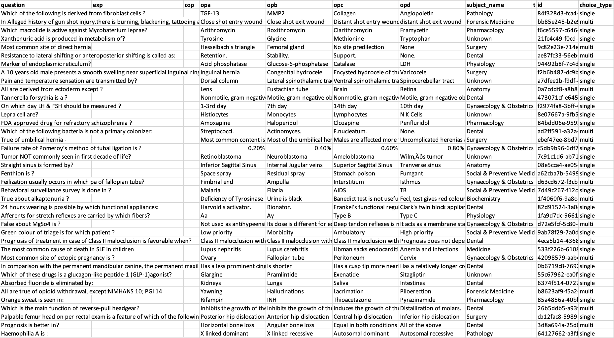
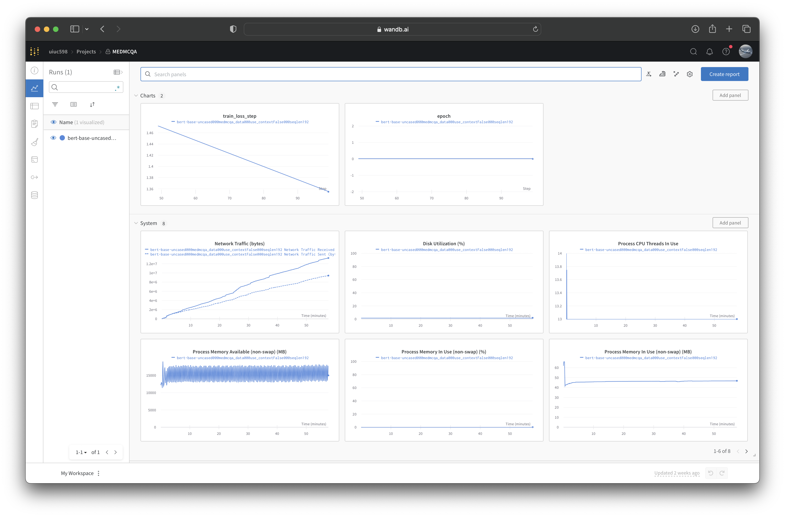
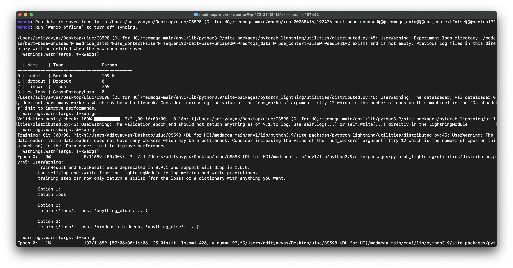
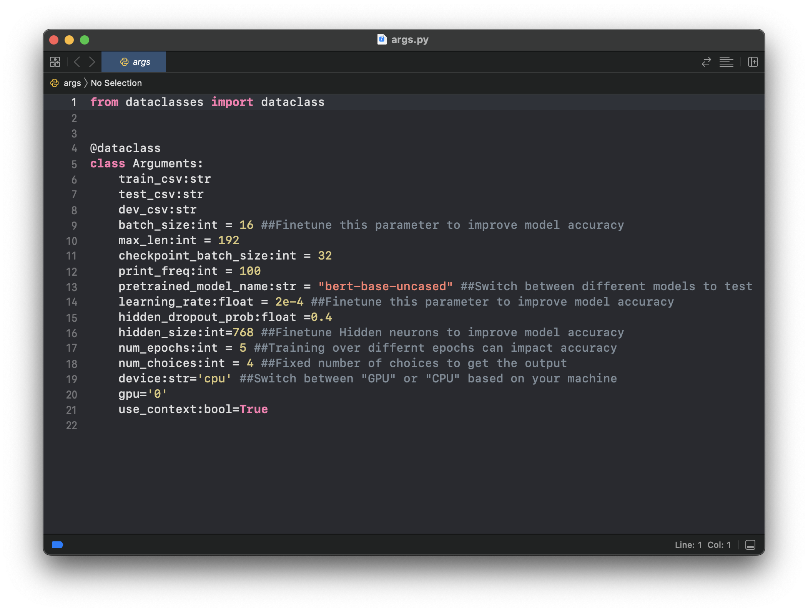

<h1 align="center">CS 598 Final Project</h1>

This repository contains the code and resources for reproducing the experiments presented in the paper "MedMCQA: A Large-scale Multi-Subject Multi-Choice Dataset for Medical domain Question Answering" by Pal, Ankit and Umapathi, Logesh Kumar and Sankarasubbu, Malaikannan (2022). The paper introduces the MedMCQA dataset, a collection of 21,000 medical multiple-choice questions aimed at evaluating the performance of various AI models in the medical question-answering domain. The original study evaluates several baseline models, including BERT-based models and domain-specific models like BioBERT, SciBERT, and PubMedBERT.

## Credit to Authors:

All credit for the original research, dataset, and methodology goes to the authors of the paper - Pal, Ankit and Umapathi, Logesh Kumar and Sankarasubbu, Malaikannan. This repository is an independent effort to reproduce the experiments conducted in their study, and any deviations or modifications from the original work are solely the responsibility of the creators of this repository. We encourage users to refer to the original paper and the authors' code repository for the most accurate and up-to-date information on the MedMCQA dataset and the experiments conducted.


## Dataset Description

|     | Links  | 
| :-------------: |:-------------:|
| **Homepage:** |  https://medmcqa.github.io  | 
| **Original Repository:** |  https://github.com/medmcqa/medmcqa  | 
| **Paper:** |  https://arxiv.org/abs/2203.14371  | 

## Dataset Summary

MedMCQA is a large-scale, Multiple-Choice Question Answering (MCQA) dataset designed to address real-world medical entrance exam questions.

MedMCQA has more than 194k high-quality AIIMS & NEET PG entrance exam MCQs covering 2.4k healthcare topics and 21 medical subjects are collected with an average token length of 12.77 and high topical diversity.

Each sample contains a question, correct answer(s), and other options which require a deeper language understanding as it tests the 10+ reasoning abilities of a model across a wide range of medical subjects & topics. A detailed explanation of the solution, along with the above information, is provided in this study.

MedMCQA provides an open-source dataset for the Natural Language Processing community.
It is expected that this dataset would facilitate future research toward achieving better QA systems.
The dataset contains questions about the following topics:

- Anesthesia
- Anatomy
- Biochemistry
- Dental
- ENT
- Forensic Medicine (FM)
- Obstetrics and Gynecology (O&G)
- Medicine
- Microbiology
- Ophthalmology
- Orthopedics
- Pathology
- Pediatrics
- Pharmacology
- Physiology
- Psychiatry
- Radiology
- Skin
- Preventive & Social Medicine (PSM)
- Surgery

## Requirements

To install the package requirements to run the code, using the following command -

`pip3 install -r requirements.txt`

## Data download & Pre-processing

To download the data, use the following link provided by the original authors -

data : https://drive.google.com/uc?export=download&id=15VkJdq5eyWIkfb_aoD3oS8i4tScbHYky

The goal of MedMCQA is to emulate the rigor of real word medical domain exams. To enable that, a predefined split of the dataset is provided. The split is by exams instead of the given questions. This also ensures the reusability and generalization ability of the models. 

- The training set of MedMCQA consists of all the collected mock & online test series. 
- The test set consists of all AIIMS PG exam MCQs (years 1991-present). 
- The development set consists of NEET PG exam MCQs (years 2001-present) to approximate real exam evaluation.

Similar questions from train , test and dev set were removed based on similarity. The final split sizes are as follow:

|                             | Train   | Valid | Test |
| -----                       | ------ | ----- | ---- |
| Question #| 182,822 |  6,150 | 4,183|
| Vocab       | 94,231 |  11,218 | 10,800 |
| Max Ques tokens    | 220  |  135| 88 |
| Max Ans tokens | 38 | 21 | 25 |

<p align="center">
  
</p>

## Experiment code

To run the experiments mentioned in the reproduced paper, follow the below steps - 
- Clone the repo

- You may want to use virtual environment to not disturb the global dependencies -

On Mac, you can use the following commands - 
Install the library -
`pip install virtualenv`
To create virtualenv (we have named the environment as env1 -
`virtualenv env1`
To start virtualenv -
`source env1/bin/activate`

- Install the dependencies 

`pip3 install -r requirements.txt`

If the above command gives error while building wheel for any of the packages, you can try the below command to reset the cache and install the libraries again - 
`pip cache purge`

<p align="center">
  
</p>


- Download the data from google drive link (provided above)
- Unzip the data to the following folder - 

`~/Desktop/uiuc/CS598/Medmcqa Code/content/data`
The dataset has 3 JSON files named - train.json, dev.json, test.json 

- Since our code accepts CSV as an input for training the model, we need to run a python script which can convert the JSON to CSV -

`$ python json_to_csv.py`
Initially it will run the script for "train.json" file. Later you can change the  `file_name` parameter in the code to `dev` or `test` to create CSVs for those files too.

- Place the new CSV files to the follwoung folder - 
`/content/medmcqa_data`

- finally run below command with the data path to train the model 

` python3 train.py --model bert-base-uncased --dataset_folder_name "/content/medmcqa_data/" `

<p align="center">
  
</p>

- The code is integrated with Weights and Biases (https://wandb.ai/home)
User may be asked to input wandb API credentials.

The files related to it will be stored in the following folder -
`wandb` 
<p align="center">
  
</p>

## Supported Tasks and Leaderboards

multiple-choice-QA, open-domain-QA: The dataset can be used to train a model for multi-choice questions answering, open domain questions answering. Questions in these exams are challenging and generally require deeper domain and language understanding as it tests the 10+ reasoning abilities across a wide range of medical subjects & topics.

## Languages

The questions and answers are only available in English.

## Dataset Structure

### Sample Data Instance

```
{
    "question":"A 39-year-old man presents with 5 days of productive cough and fever. Pseudomonas aeruginosa is isolated from a pulmonary abscess. CBC shows an acute effect characterized by marked leukocytosis (50,000 mL) and the differential count reveals a shift to left in granulocytes. Which of the following terms best describes these hematologic findings?",
    "exp": "Circulating levels of leukocytes and their precursors may occasionally reach very high levels (>50,000 WBC mL). These extreme elevations are sometimes called leukemoid reactions because they are similar to the white cell counts observed in leukemia, from which they must be distinguished. The leukocytosis occurs initially because of the accelerated release of granulocytes from the bone marrow (caused by cytokines, including TNF and IL-1) There is a rise in the number of both mature and immature neutrophils in the blood, referred to as a shift to the left. In contrast to bacterial infections, viral infections (including infectious mononucleosis) are characterized by lymphocytosis Parasitic infestations and certain allergic reactions cause eosinophilia, an increase in the number of circulating eosinophils. Leukopenia is defined as an absolute decrease in the circulating WBC count.",
    "cop":1,
    "opa":"Leukemoid reaction",
    "opb":"Leukopenia",
    "opc":"Myeloid metaplasia",
    "opd":"Neutrophilia",
    "subject_name":"Pathology",
    "topic_name":"Basic Concepts and Vascular changes of Acute Inflammation",
    "id":"4e1715fe-0bc3-494e-b6eb-2d4617245aef",
    "choice_type":"single"
}
```
### Data Attributes

- `id` : a string question identifier for each example
- `question` : question text (a string)
- `opa` : Option A
- `opb` : Option B
- `opc` : Option C
- `opd` : Option D
- `cop` : Correct option (Answer of the question)
- `choice_type` : Question is `single-choice` or `multi-choice`
- `exp` : Expert's explanation of the answer
- `subject_name` : Medical Subject name of the particular question
- `topic_name` : Medical topic name from the particular subjects

## Results 

Here are the results of the study I reproduced from training and testing the models.

|                             | Original Paper Accuracy   | Our STudy Accuracy |
| -----                       | ------ | ----- |
| BERT | 37% |  36.8% |
| BioBERT       | 42.3% |  41.9% |
| SciBERT    | 43.6%  |  42.1% |
| PubMedBERT | 47% | 46.2% |


## Beyond reproducing the paper results

To perform experimentations beyond the paper and standard hyper-parameters, I tried to finetune the values with a motive to increase the accuracy of the model. 

In the `/confs/args.py` file you can find the parameters which we tweaked during the experiments.

<p align="center">
  
</p>

